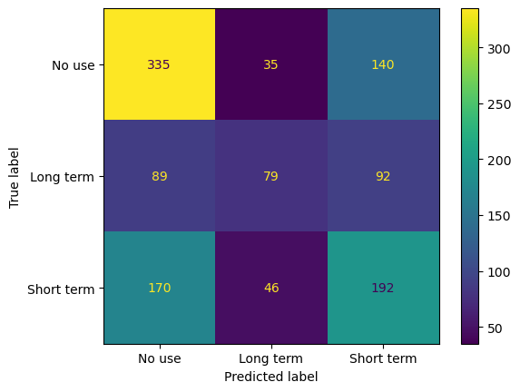

```{r setup, include=FALSE}
knitr::opts_chunk$set(echo = FALSE)
library(tidyverse)
library(knitr)
library(kableExtra)
```

## Summary

In this project, we study how the use of different contraceptive plans are associated with various personal and socio-economic factors of the user. The aim of this study is to aid scientists and healthcare organizations understand how different factors that affect contraception plans. As an example, policy makers in healthcare organization would be able to identify which age-group or socio-economic class of the society to introduce subsidized contraceptive plans for with this analysis.

We conducted an inferential analysis using a generalized linear model with multinomial logistic regression, and found that the number of children and user's education level have very obvious association with the contraceptive plan they follow. We also conducted multi-class classification predictive analysis to see how well we are able to predict a user's contraceptive strategy using the personal and socio-economic attributes of the user. We found that gradient boosting methods perform really well. However, we improved the logistic regression model (due to its interpretability) with hyperparameter optimization and achieved and weighted average f1 score of 0.54 on the test set.

**Disclaimer:** The dataset we use is really small and old, and cannot represent populations in general. There may also be important attributes/features that are missing from the data. This is also evident from not-so-great classification metrics obtained. The purpose of this study is only to render a layout of a potential study, should a representative enough data are available.

## Dataset

The [dataset](https://archive.ics.uci.edu/ml/datasets/Contraceptive+Method+Choice) we use is obtained from [UCI Machine Learning repository](https://archive.ics.uci.edu/ml/index.php). This dataset is a subset of the 1987 National Indonesia Contraceptive Prevalence Survey. The samples are married women who were either not pregnant or do not know if they were at the time of interview. The problem is to predict the current contraceptive method choice (no use, long-term methods, or short-term methods) of a woman based on her demographic and socio-economic characteristics. The attributes of the data are:

1. Wife's age (numerical): encoded in the notebooks as `age`
2. Wife's education (categorical) `1`=low, `2`, `3`, `4`=high: encoded in the notebooks as `education`
3. Husband's education (categorical) `1`=low, `2`, `3`, `4`=high: encoded in the notebooks as `spouse_education`
4. Number of children ever born (numerical): encoded in the notebooks as `children`
5. Wife's religion (binary) `0`=Non-Islam, `1`=Islam: encoded in the notebooks as `religion``
6. Wife's now working? (binary) `0`=Yes, `1`=No: encoded in the notebooks as `work`
7. Husband's occupation (categorical) `1`, `2`, `3`, `4`: encoded in the notebooks as `spouse_occupation`
8. Standard-of-living index (categorical) `1`=low, `2`, `3`, `4`=high: encoded in the notebooks as `living_standard`
9. Media exposure (binary) `0`=Good, `1`=Not good: encoded in the notebooks as `media_exposure`
10. Contraceptive method used (class attribute) `1`=No-use, `2`=Long-term, `3`=Short-term: encoded in the notebooks as `contraceptive_method`

## Exploratory Data Analysis Results

The coding and analysis can be found in [this notebook](https://github.com/qurat-azim/contraceptive_methods_analysis/blob/main/src/Preliminary_EDA.ipynb). We observe that women who are past the avergae age of 35 years more likely opt for long term contraceptive methods, while those around 32 years of age do not use any. This can be attributed to them wanting more children. Women who are considerably younger will have short term contraceptive methods in use.

```{r fig.cap="**Figure 1.** Contraceptive methods by `age`", fig.align='center', out.width = '50%'}

knitr::include_graphics("../results/eda_results/boxplot_age.svg")
```

Women with more children tend to have contraceptive plans in place. However, those with less children opt for no contraception.

```{r fig.cap="**Figure 2.** Contraceptive methods by `children`", fig.align='center', out.width = '50%'}

knitr::include_graphics("../results/eda_results/boxplot_children.svg")
```

We observe that there is a very small percentage fo women among those with the lowest `living_standard` that use contraception. This could be attributed to the lack of financial resources to be able to use it.

```{r fig.cap="**Figure 3.** Contraceptive methods by `living_standard`", fig.align='center', out.width = '35%'}

knitr::include_graphics("../results/eda_results/livingstandard.svg")
```

We see that for all the  contraceptive methods cases, there are users who work and do not work. However, for those using short term contraception, the porpotion of users who work is  significantly larger.

```{r fig.cap="**Figure 4.** Contraceptive methods by `work` status", fig.align='center', out.width = '25%'}

knitr::include_graphics("../results/eda_results/counts.svg")
```

We observe form the following figure that there is noticeable negative correlation among `education` and `media_exposure` while positive correlations exist between `age` and `children`, and `education` and `spouse_education`.

```{r this, fig.cap="**Figure 5.** Correlations among attributes", fig.align='center', out.width = '60%'}

knitr::include_graphics("../results/eda_results/correlations.svg")
```

Lastly, we observe that the distributions for `living_standard`, `age`, `education` and `children` have significant areas where the three contraceptive methods do not overlap.

```{r fig.cap="**Figure 6.** Attribute distributions", fig.align='center', out.width = '70%'}


```

## Inferential Study Results

Our response variable is `contraceptive_method`, which is a categorical variable with more than two classes. Therefore we used a generalized multiinomial logistic regression approach to derive inference for our study. We derive inference in two ways: using simple regression while considering one regressor at a time for six different regressors, and then using a multiple regression model. From the simple regression models, we have the following statistically significant (at level of 0.05) conclusions:

- With each year's increase in `age`, a woman is 1.05 times more likely to use no contraceptive methods as opposed to long term contraception.

- With each number increase in `children`, a woman is 1.08 times more likely to use long term contraception than no contraception and 1.15 times more likely to use short term contraception as opposed to no contraception.

- When the woman's `religion` is Islam, she is 1.15 times more likely to use no contraception rather than short term contraception.

- A woman with medium-low (`2`) level of `education` is 1.77 times more likely than a woman with low(`1`) level of education to use long term contraception and 2.41 times more likely to use short term contraception as opposed to no contraception.

- A woman with medium-high (`3`) level of `education` is 2.28 times more likely than a woman with low(`1`) level of education to use long term contraception and 5.23 times more likely to use short term contraception as opposed to no contraception.

- A woman with high (`4`) level of `education` is 2.87 times more likely than a woman with low(`1`) level of education to use long term contraception and 13.54 times more likely to use short term contraception as opposed to no contraception.

- A woman who `works` is 1.35 times more likely than the one who doesn't to use long term contraception as opposed to no contraception.

- A woman with medium low (`2`) level of `living_standard` is 2.28 times more likely than the one with low (`1`) `living_standard` to use short term contraception than no contraception.

- A woman with medium high (`3`) level of `living_standard` is 1.71 times more likely to use long term contraception and 4.35 times more likely to use long term contraception than no contraception, when compared to the one with low (`1`) `living_standard`.

- A woman with high (`4`) level of `living_standard` is 1.87 times more likely to use long term contraception and 7.31 times more likely to use long term contraception than no contraception, when compared to the one with low (`1`) `living_standard`.

Please note that all these interpretations are made for simple regression models only therefore are valid only when rest of the attributes are kept constant.

We also ran a multiple regression model, regressing contraception method against many, but not all, regressors at the same time. The model showed that the there are significant associations between `contraceptive_method` and 

- high `living_standard`
- `age`
- high level of `education`
- number of `children`

More detailed tidy tables can be accessed in [this notebook](https://github.com/qurat-azim/contraceptive_methods_analysis/blob/main/src/multinomial_inference.ipynb).

## Predictive Modelling Results

For our predictive analysis, we want to be able to predict the class of our target `contraceptive_method` given a set of features from the dataset. To be able to conduct the predictive analysis, we preprocessed the attributes to encode `age` and `children` as numerical features; `spouse_occupation` as nominal feature; `religion`, `work`, `media_exposure` as binary features; and `education`, `spouse_education`, `living_standard` as ordinal features. We then used various ML models with cross-validation to identify how good the model performs at classifying the class correctly. Since we do not have a preference for a certain class, or for minimizing false positives or negatives, we score our models using `f1` metric with weighted average over all classes. We would also like to mention here we expect low classification sores as this is a multiclass classification problem.

We first tried Ridge classifier, and obtain unsatisfactory results on the training set as shown in following confusion matrix.

```{r fig.cap="**Figure 7.** confusion matrix ridge", fig.align='center', out.width = '50%'}


```


Next, we used the logistic regression model to obtain feature importances for all the classes. We observed that `age` is the most important features for predicting no contraception while `education` and `children` contribute negatively towards predicting no contraception. `children` (positive contribution), `education`  (positive contribution) and `religion` (negative contribution) are most important for long term contraceptive use. Religion becomes an important feature and makes sense because, according to our knowledge, Islam discourages permanent contraception. This provides a nice sanity check for our analysis. For short term contraception, `age`, `children` and `media_exposure` are most important.

```{r fig.align='center'}
read.csv("../results/analysis_results/feature_importances.csv") %>%
  mutate_if(is.numeric, round, 3) %>%
  kable(caption = "Table 1. Feature importances for all classes") %>%
  kable_styling(full_width = T, font_size = 10) %>%
  kable_classic_2(full_width = T) %>%
  scroll_box(width = "100%", height = "200px")
```


We then obtained successively better cross validation results (`f1` score from 0.48 up to 0.54) with Logistic regression, support vector machines, random forests, and gradient boosting methods.

We finally chose to use polynomial features with degree 2 and then hyperparameter optimization. We applied this for the logistic regression model due to ease in interpretability. The resulting confusion matrix with this optimized model is:

```{r fig.cap="**Figure 7.** confusion matrix optimal", fig.align='center', out.width = '50%'}


```

After performing these two steps, we obtained a weighted `f1` score of 0.60 on training and 0.54 on testing data. More details of the analysis can be found in [this notebook](https://github.com/qurat-azim/contraceptive_methods_analysis/blob/main/src/ML_models.ipynb).
