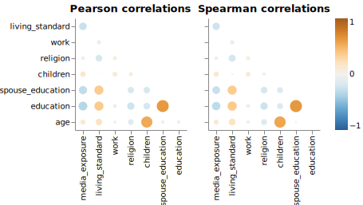

Contraceptive Methods Analysis
================
Qurat-ul-Ain Azim
04/03/2023 (updated: 2023-04-04)

- <a href="#summary" id="toc-summary">Summary</a>
- <a href="#dataset" id="toc-dataset">Dataset</a>
- <a href="#exploratory-data-analysis-results"
  id="toc-exploratory-data-analysis-results">Exploratory Data Analysis
  Results</a>
- <a href="#inferential-study-results"
  id="toc-inferential-study-results">Inferential Study Results</a>
- <a href="#predictive-modelling-results"
  id="toc-predictive-modelling-results">Predictive Modelling Results</a>

## Summary

In this project, we study how the use of different contraceptive plans
are associated with various personal and socio-economic factors of the
user. The aim of this study is to aid scientists and healthcare
organizations understand how different factors affect contraception. As
an example, a policy makers in healthcare organization would be able to
identify which age-group or socio-economic class of the society to
introduce subsidized contraceptive plans for.

We conducted an inferential analysis using a generalized linear model
with multinomial logistic regression, and found that the number of
children and user’s education level have very obvious association with
the contraceptive plan they follow. We also conducted multi-class
classification predictive analysis to see how well we are able to
predict a user’s contraceptive strategy using the personal and
socio-economic attributes of the user. We found that gradient boosting
methods perform really well. However, we improved the logistic
regression model (due to its interpretability) with hyperparameter
optimization and achieved and weighted average f1 score of 0.54 on the
test set.

**Disclaimer:** The dataset we use is really small and old, and cannot
represent populations in general. There may also be important
attributes/features that are missing from the data. This is also evident
from not-so-great classification metrics obtained. The purpose of this
study is only to render a layout of a potential study, should a
representative enough data are available.

## Dataset

The
[dataset](https://archive.ics.uci.edu/ml/datasets/Contraceptive+Method+Choice)
we use is obtained from [UCI Machine Learning
repository](https://archive.ics.uci.edu/ml/index.php). This dataset is a
subset of the 1987 National Indonesia Contraceptive Prevalence Survey.
The samples are married women who were either not pregnant or do not
know if they were at the time of interview. The problem is to predict
the current contraceptive method choice (no use, long-term methods, or
short-term methods) of a woman based on her demographic and
socio-economic characteristics. The attributes of the data are:

1.  Wife’s age (numerical): encoded in the notebooks as `age`
2.  Wife’s education (categorical) `1`=low, `2`, `3`, `4`=high: encoded
    in the notebooks as `education`
3.  Husband’s education (categorical) `1`=low, `2`, `3`, `4`=high:
    encoded in the notebooks as `spouse_education`
4.  Number of children ever born (numerical): encoded in the notebooks
    as `children`
5.  Wife’s religion (binary) `0`=Non-Islam, `1`=Islam: encoded in the
    notebooks as \`religion\`\`
6.  Wife’s now working? (binary) `0`=Yes, `1`=No: encoded in the
    notebooks as `work`
7.  Husband’s occupation (categorical) `1`, `2`, `3`, `4`: encoded in
    the notebooks as `spouse_occupation`
8.  Standard-of-living index (categorical) `1`=low, `2`, `3`, `4`=high:
    encoded in the notebooks as `living_standard`
9.  Media exposure (binary) `0`=Good, `1`=Not good: encoded in the
    notebooks as `media_exposure`
10. Contraceptive method used (class attribute) `1`=No-use,
    `2`=Long-term, `3`=Short-term: encoded in the notebooks as
    `contraceptive_method`

## Exploratory Data Analysis Results

The coding and analysis can be found in [this
notebook](https://github.com/qurat-azim/contraceptive_methods_analysis/blob/main/src/Preliminary_EDA.ipynb).
We observe that women who are past the avergae age of 35 years more
likely opt for long term contraceptive methods, while those around 32
years of age do not use any. This can be attributed to them wanting more
children. Women who are considerably younger will have short term
contraceptive methods in use.

Women with more children tend to have contraceptive plans in place.
However, those with less children opt for no contraception.

We observe that there is a very small percentage fo women among those
with the lowest `living_standard` that use contraception. This could be
attributed to the lack of financial resources to be able to use it.

We see that for all the contraceptive methods cases, there are users who
work and do not work. However, for those using short term contraception,
the porpotion of users who work is significantly larger.

We observe form the following figure that there is noticeable negative
correlation among `education` and `media_exposure` while positive
correlations exist between `age` and `children`, and `education` and
`spouse_education`.

Lastly, we observe that the distributions for `living_standard`, `age`,
`education` and `children` have significant areas where the three
contraceptive methods do not overlap.

## Inferential Study Results

Our response variable is `contraceptive_method`, which is a categorical
variable with more than two classes. Therefore we used a generalized
multiinomial logistic regression approach to derive inference for our
study. We derive inference in two ways: using simple regression while
considering one regressor at a time for six different regressors, and
then using a multiple regression model. From the simple regression
models, we have the following statistically significant conclusions:

- With each year’s increase in `age`, a woman is 1.05 times more likely
  to use no contraceptive methods as opposed to long term contraception.

- With each number increase in `children`, a woman is 1.08 times more
  likely to use long term contraception than no contraception and 1.15
  times more likely to use short term contraception as opposed to no
  contraception.

- When the woman’s `religion` is Islam, she is 1.15 times more likely to
  use no contraception rather than short term contraception.

- A woman with medium-low (`2`) level of `education` is 1.77 times more
  likely than a woman with low(`1`) level of education to use long term
  contraception and 2.41 times more likely to use short term
  contraception as opposed to no contraception.

- A woman with medium-high (`3`) level of `education` is 2.28 times more
  likely than a woman with low(`1`) level of education to use long term
  contraception and 5.23 times more likely to use short term
  contraception as opposed to no contraception.

- A woman with high (`4`) level of `education` is 2.87 times more likely
  than a woman with low(`1`) level of education to use long term
  contraception and 13.54 times more likely to use short term
  contraception as opposed to no contraception.

- A woman who `works` is 1.35 times more likely than the one who doesn’t
  to use long term contraception as opposed to no contraception.

- A woman with medium low (`2`) level of `living_standard` is 2.28 times
  more likely than the one with low (`1`) `living_standard` to use short
  term contraception than no contraception.

- A woman with medium high (`3`) level of `living_standard` is 1.71
  times more likely to use long term contraception and 4.35 times more
  likely to use long term contraception than no contraception, when
  compared to the one with low (`1`) `living_standard`.

- A woman with high (`4`) level of `living_standard` is 1.87 times more
  likely to use long term contraception and 7.31 times more likely to
  use long term contraception than no contraception, when compared to
  the one with low (`1`) `living_standard`.

Please note that all these interpretations are made for simple
regression models only therefore are valid only when rest of the
attributes are kept constant.

## Predictive Modelling Results
